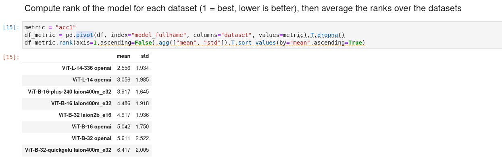

# CLIP Benchmark
[](https://pypi.python.org/pypi/clip_benchmark)

The goal of this repo is to evaluate CLIP-like models on a standard set
of datasets on different tasks such as zero-shot classification and zero-shot
retrieval, and captioning.

Below we show the average rank (1 is the best, lower is better) of different CLIP models, evaluated
on different datasets.



The current detailed results of the benchmark can be seen [here](benchmark/README.md)
or directly in the [notebook](benchmark/results.ipynb).

## Features

* Support for zero-shot classification and zero-shot retrieval, linear probing, and captioning.
* Support for [OpenCLIP](https://github.com/mlfoundations/open_clip) pre-trained models, [Japanese CLIP](https://github.com/rinnakk/japanese-clip), and [NLLB CLIP](https://arxiv.org/abs/2309.01859) for general multilingual abilities.
* Support various datasets from [torchvision](https://pytorch.org/vision/stable/datasets.html), [tensorflow datasets](https://www.tensorflow.org/datasets), and [VTAB](https://github.com/google-research/task_adaptation).
* Support for various multilingual datasets for classification and retrieval
* Support for compositionality tasks

## How to install?

`pip install clip-benchmark`

## How to use?

To evaluate we recommend to create a models.txt like
```
ViT-B-32,openai
```

to get the list of datasets 
```
wget https://raw.githubusercontent.com/LAION-AI/CLIP_benchmark/main/benchmark/webdatasets.txt
```

Then to run

```
clip_benchmark eval --pretrained_model models.txt \
    --dataset "webdatasets.txt" \
    --dataset_root "https://huggingface.co/datasets/clip-benchmark/wds_{dataset_cleaned}/tree/main" \
    --output "benchmark_{dataset}_{pretrained}_{model}_{language}_{task}.json"
```

Then to get the full table

```
clip_benchmark build benchmark_*.json --output benchmark.csv
```


### Command line interface (CLI)

The easiest way to benchmark the models is using the CLI, `clip_benchmark`.
You can specify the model to use, the dataset and the task to evaluate on. Once it is done, evaluation is performed and
the results are written into a JSON file.

### Using other models than openclip

It is possible to use other models than openclip ones. For example japanese-clip is supported

Here is an example of use

```
>>> python3 clip_benchmark/cli.py eval \
  --model_type "ja_clip" \ # flag to use japanese-clip
  --pretrained "rinna/japanese-cloob-vit-b-16" \ # now, we have `rinna/japanese-cloob-vit-b-16` or `rinna/japanese-clip-vit-b-16`. 
  --language "jp" \
  --task "zeroshot_classification"  \
  --dataset "imagenet1k"  \
  --dataset_root {ROOT_PATH} 

>>> cat result.json
{"dataset": "imagenet1k", "model": "ViT-B-32-quickgelu", "pretrained": "rinna/japanese-cloob-vit-b-16", "task": "zeroshot_classification", "metrics": {"acc1": 0.54636, "acc5": 0.72856, "mean_per_class_recall": 0.54522}, "language": "jp"}
```

### How to add other CLIP models

Please follow these steps:
1. Add a identity file to load model in `clip_benchmark/models`
2. Define a loading function, that returns a tuple (model, transform, tokenizer). Please see `clip_benchmark/models/open_clip.py` as an example. 
3. Add the function into `TYPE2FUNC` in `clip_benchmark/models/__init__.py`

Remarks:
- The new tokenizer/model must enable to do the following things as https://github.com/openai/CLIP#usage
  - `tokenizer(texts).to(device)`  ... `texts` is a list of string
  - `model.encode_text(tokenized_texts)` ... `tokenized_texts` is a output from `tokenizer(texts).to(device)`
  - `model.encode_image(images)` ... `images` is a image tensor by the `transform`


### CIFAR-10 example

 Here is an example for CIFAR-10 zero-shot classification using OpenCLIP's pre-trained model on LAION-400m:

 `clip_benchmark eval --dataset=cifar10 --task=zeroshot_classification --pretrained=laion400m_e32 --model=ViT-B-32-quickgelu --output=result.json --batch_size=64`

 By default, the dataset is downloaded into `--dataset_root`, which by default is `root`.

Here is the content of `result.json` after the evaluation is done:

```json
{
    "dataset": "cifar10", "model": "ViT-B-32-quickgelu", 
    "pretrained": "laion400m_e32", "task": "zeroshot_classification",
    "metrics": {"acc1": 0.9074, "acc5": 0.998}
}
```


### VOC2007 example

Here is another example with VOC2007, which is a multi-label classification dataset.

 `clip_benchmark eval --dataset=voc2007_multilabel --task=zeroshot_classification --pretrained=laion400m_e32 --model=ViT-B-32-quickgelu --output=result.json --batch_size=64`

Here is the content of `result.json` after the evaluation is done:

```json
{"dataset": "voc2007_multilabel", "model": "ViT-B-32-quickgelu", "pretrained": "laion400m_e32", "task": "zeroshot_classification", "metrics": {"mean_average_precision": 0.7627869844436646}}
```

Here, we compute the mean average precision or mAP, more details about that metric [here](https://fangdahan.medium.com/calculate-mean-average-precision-map-for-multi-label-classification-b082679d31be) in the context of multi-label classification.

### VTAB example

Here is an example on how to run it on [VTAB](https://github.com/google-research/task_adaptation) classification tasks.
First, you need to install VTAB's dedicated package.

`pip install task_adaptation==0.1`

Then, you can run it by providing the full dataset name.
Example with `eurosat`:

 `clip_benchmark eval --dataset=vtab/eurosat --task=zeroshot_classification --pretrained=laion400m_e32 --model=ViT-B-32-quickgelu --output=result.json --batch_size=64`

See [clip_benchmark/datasets/builder.py#L634](clip_benchmark/datasets/builder.py#L634) for the full list of 
VTAB dataset collection.


### TensorFlow dataset example

Here is an example on how to run it on [Tensorflow datasets](https://www.tensorflow.org/datasets).
First, you need to install `tfds-nightly` and `timm`.

`pip install timm tfds-nightly`


The name of the dataset follows the template `tfds/<DATASET_NAME>`.

Example with `cifar10`:

 `clip_benchmark eval --dataset=tfds/cifar10 --task=zeroshot_classification --pretrained=laion400m_e32 --model=ViT-B-32-quickgelu --output=result.json --batch_size=64`


### COCO captions retrieval example

 Here is an example for COCO captions zero-shot retrieval:

 `clip_benchmark eval --dataset=mscoco_captions --task=zeroshot_retrieval --pretrained=laion400m_e32 --model=ViT-B-32-quickgelu --output=result.json --batch_size=64` 
 
 Note that for using COCO, you also need to install `pycocotools` (e.g., using `pip install pycocotools`).


### COCO captions captioning example

 Here is an example for COCO captions captioning task:

 `clip_benchmark eval --dataset=mscoco_captions --task=captioning --model=coca_ViT-L-14 --output=result.json --pretrained mscoco_finetuned_laion2b_s13b_b90k`

 Note that for using COCO, you also need to install `pycocotools` (e.g., using `pip install pycocotools`) and `pycocoevalcap`.

### Linear probing example

Full linear probing on train split, evaluate on test split:

`clip_benchmark eval --dataset=cifar10 --task=linear_probe --pretrained=laion400m_e32 --model=ViT-B-32-quickgelu --output=result.json --batch_size=64 --fewshot_lr 0.1 --fewshot_epochs 20 --batch_size 512 --train_split train --test_split test`


few-shot (k=5) linear probing on train split, evaluate on test split:

`clip_benchmark eval --dataset=cifar10 --task=linear_probe --pretrained=laion400m_e32 --model=ViT-B-32-quickgelu --output=result.json --batch_size=64 --fewshot_k 5 --fewshot_lr 0.1 --fewshot_epochs 20 --batch_size 512 --train_split train --test_split test`

Split train into train (90%), val (10%), do linear probing on train split, tune on val split, evaluate on test split:

`clip_benchmark eval --dataset=cifar10 --task=linear_probe --pretrained=laion400m_e32 --model=ViT-B-32-quickgelu --output=result.json --batch_size=64 --fewshot_lr 0.1 --fewshot_epochs 20 --batch_size 512 --train_split train --val_proportion 0.1 --test_split test`

For other datasets that have an official val split, one can also specify the val split:

`clip_benchmark eval --dataset=fgvc_aircraft --task=linear_probe --pretrained=laion400m_e32 --model=ViT-B-32-quickgelu --output=result.json --batch_size=64 --fewshot_lr 0.1 --fewshot_epochs 20 --batch_size 512 --train_split train --val_split val --test_split test`

### Multilingual evaluation

We also provide datasets for evaluating multilingual models (see e.g. https://github.com/mlfoundations/open_clip#vit-b32-xlm-roberta-base, and https://github.com/mlfoundations/open_clip/blob/main/docs/openclip_multilingual_retrieval_results.csv) by specifying `--language`.

For ImageNet-1k (zero-shot classification):

- `clip_benchmark eval --model xlm-roberta-base-ViT-B-32 --pretrained laion5b_s13b_b90k --dataset=imagenet1k --output=result.json --batch_size=64 --language=<LANG>`, where `<LANG>` can be among `zh` (chinese), `it` (italian), `jp` (japanese), `en` (english), `ar` (arabic).
- We also support Babel ImageNet classnames and prompts (https://github.com/gregor-ge/Babel-ImageNet), which can be used as the following: `clip_benchmark eval --model xlm-roberta-base-ViT-B-32 --pretrained laion5b_s13b_b90k --dataset=babel_imagenet --output=result.json --batch_size=64 --language=<LANG>`, 
where `<LANG>` is a two letter string from the [ISO language code list](https://en.wikipedia.org/wiki/List_of_ISO_639-1_codes). Supported values for language are: `'ne', 'id', 'de', 'nl', 'af', 'he', 'sq', 'uz', 'kn', 'ku', 'ta', 'lv', 'ko', 'ug', 'br', 'el', 'su', 'kk', 'sk', 'gl', 'om', 'fa', 'jv', 'cs', 'lo', 'hy', 'xh', 'hr', 'so', 'gu', 'am', 'ar', 'sa', 'ca', 'is', 'it', 'sv', 'ga', 'bg', 'vi', 'sd', 'ur', 'km', 'pl', 'hu', 'sr', 'fr', 'hi', 'fy', 'et', 'bs', 'sw', 'az', 'mk', 'es', 'mn', 'ja', 'tl', 'tr', 'gd', 'ro', 'mg', 'mr', 'sl', 'pt', 'lt', 'no', 'yi', 'uk', 'ky', 'ka', 'bn', 'or', 'my', 'en', 'ps', 'fi', 'zh', 'da', 'ml', 'be', 'eo', 'ha', 'eu', 'as', 'te', 'th', 'cy', 'si', 'ru', 'la', 'pa', 'ms'` 

for COCO (zero-shot retrieval):

- `clip_benchmark eval --model xlm-roberta-base-ViT-B-32 --pretrained laion5b_s13b_b90k --dataset=multilingual_mscoco_captions --output=result.json --batch_size=64 --language=<LANG>`, where `<LANG>` can be among `es` (spanish), `it` (italian), `jp` (japanese), `ko` (korean), `pl` (polish), `ru` (russian), `tr` (Turkish), `zh` (chinese), `en` (english), `fr` (french), `de` (german).

For Flickr-30k (zero-shot retrieval)

- `clip_benchmark eval --model xlm-roberta-base-ViT-B-32 --pretrained laion5b_s13b_b90k --dataset=flickr30k --output=result.json --batch_size=64 --language=<LANG>`, where `<LANG>` can be among `en` (english), `zh` (chinese).

For Flickr-8k (zero-shot retrieval)

- `clip_benchmark eval --model xlm-roberta-base-ViT-B-32 --pretrained laion5b_s13b_b90k --dataset=flickr8k --output=result.json --batch_size=64 --language=<LANG>`, where `<LANG>` can be among `en` (english), `zh` (chinese).

For [Crossmodal-3600](https://google.github.io/crossmodal-3600/) (zero-shot retrieval)

- `clip_benchmark eval --model xlm-roberta-base-ViT-B-32 --pretrained laion5b_s13b_b90k --dataset=crossmodal3600 --output=result.json --batch_size=64 --language=<LANG>`, see supported languages [here](https://github.com/LAION-AI/CLIP_benchmark/blob/main/clip_benchmark/datasets/crossmodal3600.py#L9).

For Flickr30k-200 dataset, which has 1000 captions from Flickr30k dataset translated to 200 languages using [NLLB-3.3B model](https://huggingface.co/facebook/nllb-200-3.3B) (zero-shot retrieval)

- `clip_benchmark eval --model xlm-roberta-base-ViT-B-32 --pretrained laion5b_s13b_b90k --dataset=flickr30k-200 --output=result.json --batch_size=64 --language=<LANG>`, see supported languages [here](https://github.com/LAION-AI/CLIP_benchmark/blob/main/clip_benchmark/datasets/flickr30k_200.py#L15).

For XTD200 dataset, which has captions from [XTD10](https://github.com/adobe-research/Cross-lingual-Test-Dataset-XTD10) dataset translated to 200 languages using [NLLB-3.3B model](https://huggingface.co/facebook/nllb-200-3.3B) (zero-shot retrieval)

- `clip_benchmark eval --model xlm-roberta-base-ViT-B-32 --pretrained laion5b_s13b_b90k --dataset=xtd200 --output=result.json --batch_size=64 --language=<LANG>`, see supported languages [here](https://github.com/LAION-AI/CLIP_benchmark/blob/main/clip_benchmark/datasets/xtd200.py#L15).


### Compositionality evaluation


For [Sugar Crepe](https://github.com/RAIVNLab/sugar-crepe):


`clip_benchmark eval --model ViT-B-32 --pretrained laion400m_e32 --dataset=sugar_crepe/<TASK> --output=result.json`

where `<TASK>` can be among  `add_att`, `add_obj`, `replace_att`, `replace_obj`, `replace_rel`, `swap_att`, `swap_obj`.
To evaluate on all the tasks together, you can do:

`clip_benchmark eval --model ViT-B-32 --pretrained laion400m_e32 --dataset=sugar_crepe --output=result.json`

For [winoground](https://huggingface.co/datasets/facebook/winoground/):

`clip_benchmark eval --model ViT-B-32 --pretrained laion400m_e32 --dataset=winoground --output=result.json`

NB: `pip install datasets` is required for winoground.

### Webdataset example

Here is an example on how to run it on [webdatasets](https://github.com/webdataset/webdataset).
First, you need to install `webdataset`.

`pip install webdataset`

#### Creating a webdataset

You can either convert an already supported CLIP_benchmark dataset to webdataset format, or manually create your own with the same file structure. For already supported datasets use the CLI command `clip_benchmark_export_wds` as in this example:

```
$ clip_benchmark_export_wds --dataset cifar10 --plit train --dataset_root DATA_DIR/ --output wds_cifar10/
$ clip_benchmark_export_wds --dataset cifar10 --split test --dataset_root DATA_DIR/ --output wds_cifar10/
```

which will convert the train and test splits for CIFAR-10 (downloaded to `DATA_DIR/`) and save the webdataset to `wds_cifar10/` (upload to Huggingface Hub must be done manually for now). Retrieval datasets are also supported with the `--retrieval` flag.

For other datasets, data must be stored with the following file structure:

```
root_dir/
    train/
        nshards.txt
        0.tar
        1.tar
        ...
    test/
        nshards.txt
        0.tar
        ...
    classnames.txt
    zeroshot_classification_templates.txt
    dataset_type.txt
```

Each split should be contained in its own folder and `nshards.txt` should contain a single integer corresponding to the number of TAR files. The TAR files should follow webdataset format, with an image file (.webp, .png, or .jpg) and a label (.cls) for each example. Classnames and templates are required for zeroshot classification evaluation, with each classname or template on its own line. Dataset type is required for distinguishing zeroshot retrieval evaluation: the file should just contain the text `retrieval`.

#### Evaluating on a webdataset

The name of the dataset follows the template `wds/<DATASET_NAME>`. Note that the dataset name currently only affects the name in the results output - classnames and templates are loaded directly from the included files. The dataset root directory can be either a local path to the `root_dir` as specified above, or an HTTP URL pointing to a Huggingface Hub dataset file tree.

Example with `vtab/cifar10` (zero-shot classification):

- local: `clip_benchmark eval --dataset wds/vtab/cifar10 --dataset_root ROOT_DIR/wds_vtab-cifar10/`
- remote: `clip_benchmark eval --dataset wds/vtab/cifar10 --dataset_root https://huggingface.co/datasets/clip-benchmark/wds_{dataset_cleaned}/tree/main`

Example with `mscoco_captions` (retrieval):

- local: `clip_benchmark eval --dataset=wds/mscoco_captions --dataset_root ROOT_DIR/wds_vtab-mscoco_captions/ --task=zeroshot_retrieval`
- remote: `clip_benchmark eval --dataset=wds/mscoco_captions --dataset_root="https://huggingface.co/datasets/clip-benchmark/wds_{dataset_cleaned}/tree/main" --task=zeroshot_retrieval`


Example with `mscoco_captions` (captioning):

- local: `clip_benchmark eval --dataset=wds/mscoco_captions --dataset_root ROOT_DIR/wds_vtab-mscoco_captions/ --task=captioning`
- remote: `clip_benchmark eval --dataset=wds/mscoco_captions --dataset_root="https://huggingface.co/datasets/clip-benchmark/wds_{dataset_cleaned}/tree/main" --task=captioning`


All other arguments remain the same as in the other examples. See `https://huggingface.co/clip-benchmark` for a full list of datasets that have already been uploaded to Huggingface.

## Evaluate mulitple models on multiple datasets

For the purpose of benchmarking, it is possible to run the CLI with multiple
pre-trained models on multiple datasets.


### Pretrained models and datasets list as arguments

For models, we can provide list of pretrained model names in the form of 'model,pretrained' (so `model` and `pretrained` are comma separated). For datasets, we can provide a list of datasets.  For languages, we can provide a list of languages.
Example:

```bash
clip_benchmark eval --pretrained_model  ViT-B-32-quickgelu,laion400m_e32 ViT-L-14,laion400m_e32  \
--dataset cifar10 cifar100 --dataset_root "clip_benchmark_datasets/{dataset}" --language en jp \
 --output "{dataset}_{pretrained}_{model}_{language}_{task}.json"
```

Note that `--dataset_root` and `--output` can be now in the form of a template that depends on the dataset/model/language/task (for `--output`) and dataset name (for `--dataset_root`).

Note that If the benchmark fails at some point, it is possible to resume it by skipping already evaluated models using `--skip_existing`.

### Pretrained models and datasets list as files

We can also provide a path to files with models (each line is in the form of 'model,pretrained' where `model` and `pretrained` are comma separated) and datasets list (one dataset per line):

```bash
clip_benchmark eval --pretrained_model  benchmark/models.txt \
--dataset benchmark/datasets.txt --dataset_root "clip_benchmark_datasets/{dataset}"  \
 --output "{dataset}_{pretrained}_{model}_{language}_{task}.json"
```

Examples are available in [benchmark/datasets.txt](benchmark/datasets.txt) and [benchmark/models.txt](benchmark/models.txt)

### Multiple checkpoints from the same model

It is also common to evaluate multiple checkpoints from the same model:

```bash
clip_benchmark eval --model ViT-B-32 --pretrained *.pt \
--dataset benchmark/datasets.txt --dataset_root "clip_benchmark_datasets/{dataset}"  \
 --output "{dataset}_{pretrained}_{model}_{language}_{task}.json"
```

### Model and dataset collections

We can also provide model collection names (`openai`, `openclip_base`, `openclip_multilingual`, `openclip_full` are supported) or dataset collection names (`vtab`, `vtab+`, `retrieval`, `imagenet_robustness` are supported):

```bash
clip_benchmark eval --pretrained_model openai openclip_base  --dataset vtab+ retrieval \
--dataset_root "clip_benchmark_datasets/{dataset}" --not quiet \
--output "{dataset}_{pretrained}_{model}_{language}_{task}.json"
```

See [clip_benchmark/models.py#L6](clip_benchmark/models.py#L6) and [clip_benchmark/datasets/builder.py#L634](clip_benchmark/datasets/builder.py#L634) for more information
about the collections.

### Custom templates / prompts / classnames

It is also possible to use custom prompts by providing a custom template file and/or a custom classname file.
For instance:

`clip_benchmark eval --dataset "imagenet1k" --model ViT-B-32 --pretrained laion400m_e32 --custom_template_file <path> --custom_classname_file <path>`

The template file can be either in the usual format https://github.com/LAION-AI/CLIP_benchmark/blob/main/clip_benchmark/datasets/en_zeroshot_classification_templates.json or in the CuPL format https://github.com/LAION-AI/CLIP_benchmark/blob/main/clip_benchmark/datasets/cupl_prompts.json to have class-specific prompts. In the case of the CuPL format, the classnames file will not be used, thus one only needs to provide the template file `--custom_template_file`.

For instance, the prompts from the CuPL paper https://arxiv.org/abs/2209.03320 for ImagetNet-1k can be used this way    :

`clip_benchmark eval --dataset "imagenet1k" --model ViT-B-32 --pretrained laion400m_e32 --custom_template_file cupl_prompts.json`

### Development 

For development, you can also do this:

```bash
git clone https://github.com/LAION-AI/CLIP_benchmark
cd CLIP_benchmark
python setup.py install
```

## Credits

- Thanks to [OpenCLIP](https://github.com/mlfoundations/open_clip) authors, zero-shot accuracy code is adapted from there and pre-trained models are used in the command line interface.
- Thanks to [SLIP](https://github.com/facebookresearch/SLIP) authors, some zero-shot templates and classnames are from there.
- Thanks to [Wise-ft](https://github.com/mlfoundations/wise-ft) authors, Imagenet robustness datasets code is adapted from there
- Thanks to [LiT](https://arxiv.org/abs/2111.07991.pdf) authors, some zero-shot templates and classnames of VTAB datasets are from there.
- Thanks to [Sugar Crepe](https://github.com/RAIVNLab/sugar-crepe) authors for compositionality tasks evaluation on COCO
- Thanks to [Babel ImageNet](https://github.com/gregor-ge/Babel-ImageNet) authors for multilingual evaluation of ImageNet-1k zero-shot classification.
- Thanks to [ImageNet-W](https://github.com/facebookresearch/Whac-A-Mole) authors for ImageNet-W evaluation
- Thanks to [CuPL](https://github.com/sarahpratt/CuPL) for CuPL prompts.
- Thanks to [PyCOCOevalcap](https://github.com/salaniz/pycocoevalcap) and [@gpucce](https://github.com/gpucce) for COCO captions image captioning evaluation.
- Thanks to [@li-xirong](https://github.com/li-xirong/cross-lingual-cap) for chinese Flickr-30k/FLickr-8k.
- Thanks to [Chinese CLIP](https://github.com/OFA-Sys/Chinese-CLIP) authors for chinese ImageNet-1k classnames/prompts (zero-shot classification).
- Thanks to [@rinnakk](https://github.com/rinnakk/japanese-clip) and [@mkshing](https://github.com/mkshing) for japanese ImageNet-1k classnames/prompts (zero-shot classification) and japanese CLIP support.
- Thanks to [@KhalidAlt](https://github.com/KhalidAlt) for arabic ImageNet-1k classnames/prompts (zero-shot classification).
- Thanks to [@djghosh13](https://github.com/djghosh13) for WebDataset support.
- Thanks to [@FreddeFrallan](https://github.com/FreddeFrallan) for for multilingual COCO.
- Thanks to [@mitchellnw](https://github.com/mitchellnw) for linear probing support.
- Thanks to [@teasgen](https://github.com/teasgen) for support of validation set and tuning linear probing similar to OpenAI's CLIP.
- Thanks to [@visheratin](https://github.com/visheratin) for multilingual retrieval datasets support from <https://arxiv.org/abs/2309.01859>.
- This package was created with [Cookiecutter](https://github.com/audreyr/cookiecutter) and the [audreyr/cookiecutter-pypackage](https://github.com/audreyr/cookiecutter-pypackage) project template. Thanks to the author.
