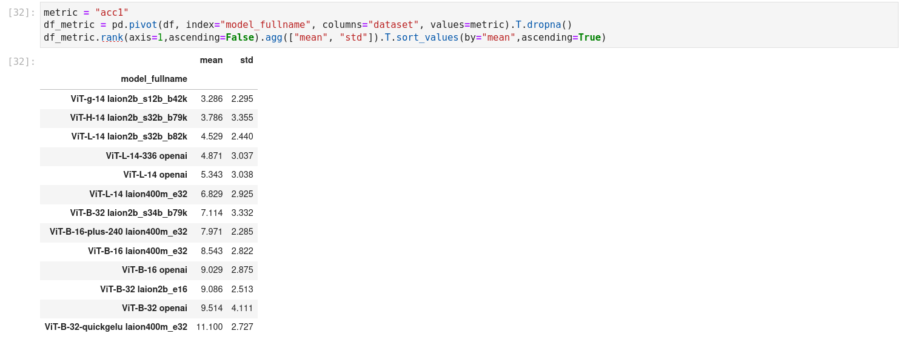

# CLIP Benchmark


The goal of this repo is to evaluate CLIP-like models on a standard set
of datasets on different tasks such as zero-shot classification and zero-shot
retrieval.

Below we show the average rank (1 is the best, lower is better) of different CLIP models, evaluated
on different datasets.



The current detailed results of the benchmark can be seen [here](benchmark/README.md)
or directly in the [notebook](benchmark/results.ipynb).

## Features

* Support for zero-shot classification and zero-shot retrieval
* Support for [OpenCLIP](https://github.com/mlfoundations/open_clip) pre-trained models
* Support various datasets from [torchvision](https://pytorch.org/vision/stable/datasets.html), [tensorflow datasets](https://www.tensorflow.org/datasets), and [VTAB](https://github.com/google-research/task_adaptation).


## How to install?

`pip install clip-benchmark`

For development, you can also do this:

```bash
git clone https://github.com/LAION-AI/CLIP_benchmark
cd CLIP_benchmark
python setup.py install
```

## How to use?

### Command line interface (CLI)

The easiest way to benchmark the models is using the CLI, `clip_benchmark`.
You can specify the model to use, the dataset and the task to evaluate on. Once it is done, evaluation is performed and
the results are written into a JSON file.

### CIFAR-10 example

 Here is an example for CIFAR-10 zero-shot classification using OpenCLIP's pre-trained model on LAION-400m:

 `clip_benchmark --dataset=cifar10 --task=zeroshot_classification --pretrained=laion400m_e32 --model=ViT-B-32-quickgelu --output=result.json --batch_size=64`

Here is the content of `result.json` after the evaluation is done:

```json
{
    "dataset": "cifar10", "model": "ViT-B-32-quickgelu", 
    "pretrained": "laion400m_e32", "task": "zeroshot_classification",
    "metrics": {"acc1": 0.9074, "acc5": 0.998}
}
```

### VOC2007 example

Here is another example with VOC2007, which is a multi-label classification dataset.

 `clip_benchmark --dataset=voc2007_multilabel --task=zeroshot_classification --pretrained=laion400m_e32 --model=ViT-B-32-quickgelu --output=result.json --batch_size=64`

Here is the content of `result.json` after the evaluation is done:

```json
{"dataset": "voc2007_multilabel", "model": "ViT-B-32-quickgelu", "pretrained": "laion400m_e32", "task": "zeroshot_classification", "metrics": {"mean_average_precision": 0.7627869844436646}}
```

Here, we compute the mean average precision or mAP, more details about that metric [here](https://fangdahan.medium.com/calculate-mean-average-precision-map-for-multi-label-classification-b082679d31be) in the context of multi-label classification.

### VTAB example

Here is an example on how to run it on [VTAB](https://github.com/google-research/task_adaptation) classification tasks.
First, you need to install VTAB's dedicated package.

`pip install task_adaptation==0.1`

The name of the dataset follows the template `vtab/<TASK_NAME>`.
To have the list of the 19 classification tasks using in VTAB, you can use:

`python -c 'from clip_benchmark.datasets.builder import VTAB_19TASKS;print("\n".join(VTAB_19TASKS))'`


Then, you can run it by providing the full dataset name.
Example with `eurosat`:

 `clip_benchmark --dataset=vtab/eurosat --task=zeroshot_classification --pretrained=laion400m_e32 --model=ViT-B-32-quickgelu --output=result.json --batch_size=64`


### TensorFlow dataset example


Here is an example on how to run it on [Tensorflow datasets](https://www.tensorflow.org/datasets).
First, you need to install `tfds-nightly` and `timm`.

`pip install timm tfds-nightly`


The name of the dataset follows the template `tfds/<DATASET_NAME>`.

Example with `cifar10`:

 `clip_benchmark --dataset=tfds/cifar10 --task=zeroshot_classification --pretrained=laion400m_e32 --model=ViT-B-32-quickgelu --output=result.json --batch_size=64`


### COCO captions example

 Here is an example for COCO captions zero-shot retrieval:

 `clip_benchmark --dataset=mscoco_captions --task=zeroshot_retrieval --pretrained=laion400m_e32 --model=ViT-B-32-quickgelu --output=result.json --dataset_root=<PATH_TO_IMAGE_FOLDER> --annotation_file=<PATH_TO_ANNOTATION_FILE> --batch_size=64` 
 
 (see <https://cocodataset.org/#home> for instructions on how to download)

 Note that for using COCO, you also need to install `pycocotools`, using:

 `pip install pycocotools`

### API

You can also use the API directly. This is especially useful if your model
does not belong to currently supported models.
(TODO)

## Credits

- Thanks to [OpenCLIP](https://github.com/mlfoundations/open_clip) authors, zero-shot accuracy code is adapted from there and pre-trained models are used in the command line interface.
- Thanks to [SLIP](https://github.com/facebookresearch/SLIP) authors, some zero-shot templates and classnames are from there.
- Thanks to [Wise-ft](https://github.com/mlfoundations/wise-ft) authors, Imagenet robustness datasets code is adapted from there
- Thanks to [LiT](https://arxiv.org/abs/2111.07991.pdf) authors, some zero-shot templates and classnames of VTAB datasets are from there.
- This package was created with [Cookiecutter]( https://github.com/audreyr/cookiecutter) and the [audreyr/cookiecutter-pypackage](https://github.com/audreyr/cookiecutter-pypackage) project template. Thanks to the author.
